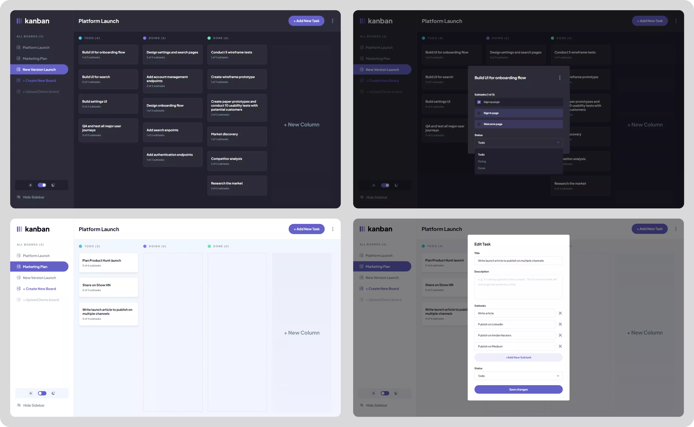

# Task Management App

CRUD app where you can manage your tasks. App built in Next.js.

Link to demo: https://kanban-task-management-omega.vercel.app \
App UI based on a project from Frontend Mentor: https://www.frontendmentor.io/challenges/kanban-task-management-web-app-wgQLt-HlbB \
When styling this app, I was also inspired by the modern UI made by the user Jay: https://www.frontendmentor.io/solutions/kanban-task-management-web-app-rFSlSM5ogv

## Table of contents

- [Introduction](#introduction)
- [Technologies](#technologies)
- [Features](#features)
- [Building process](#building-process)
- [Future Development](#future-development)
- [Installation and launch](#installation-and-launch)
- [License](#license)

## Introduction

App where you can manage tasks and subtasks in projects. The data is saved in localStorage.



## Technologies

- [Next.js](https://nextjs.org/ "Next.js Page")
- [TypeScript](https://www.typescriptlang.org/ "Typescript Page")
- [Styled Components](https://styled-components.com/ "Styled Components Page")

## Features

- Login with Google
- CRUD operations
- Saving data in localStorage
- Form validation
- Light/dark mode

## Building process

During the project, I wanted the code to be as clear as possible and open to adding new features. I included all CRUD operations in custom hooks referring to the main context with data. Due to the large number of modals, I used Portals for the first time.

The project itself turned out to be a great way to test my skills and principles of clean code, which I am still learning.

## Future Development

Currently, I am working on implementing drag and drop functionality using the React DnD library. This will enhance the user experience and allow for easier task management.

## Installation and launch

To run the application on your system, install all packages and open the app with the commands below.

```bash
npm install
npm run dev
```

## License

[MIT](https://choosealicense.com/licenses/mit/)
